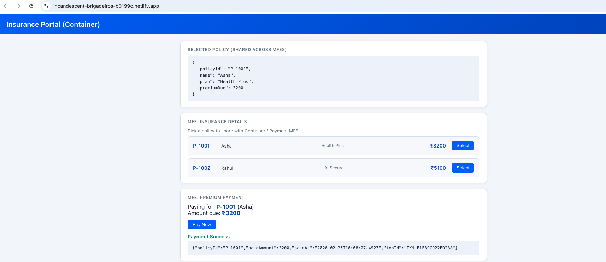

# Insurance MFE

Monorepo with one host (container) and two micro-frontends: **Insurance Details** (policy list) and **Premium Payment**. The container loads both remotes via Webpack Module Federation and shares selected policy state between them.

## Repo layout

| Folder | Role | Port |
|--------|------|------|
| `container/` | Host app | 3000 |
| `mfe-insurance-details/` | Remote: policy list & selection | 3001 |
| `mfe-premium-payment/` | Remote: pay premium for selected policy | 3002 |

## Quick start

1. **Start remotes first** (in separate terminals):

   ```bash
   cd mfe-insurance-details && npm install && npm start
   cd mfe-premium-payment  && npm install && npm start
   ```

2. **Start the container:**

   ```bash
   cd container && npm install && npm start
   ```

3. Open **http://localhost:3000**. Select a policy in Insurance Details, then use Premium Payment to pay.

Each app can also run standalone (see each module’s README).

---

## Live deployment (Netlify)

The app is deployed as **three independent Netlify sites** from this single repo: each site uses a **base directory** for its app, **Build command** `npm run build`, and **Publish directory** `dist`. The container site has **environment variables** set for the two remote URLs. All three are connected to the same repo and branch.

| App | Live URL |
|-----|----------|
| **Insurance Details** (remote) | https://darling-pavlova-d81f8c.netlify.app/ |
| **Premium Payment** (remote) | https://capable-kleicha-d6de28.netlify.app/ |
| **Container** (host – full app) | https://incandescent-brigadeiros-b0199c.netlify.app/ |

**Deploy steps (short):** Three sites created independently on Netlify, each with the correct **base folder** (`container`, `mfe-insurance-details`, `mfe-premium-payment`), same repo and `npm run build` → `dist`. On the container site, **env vars** `REMOTE_INSURANCE_DETAILS_URL` and `REMOTE_PREMIUM_PAYMENT_URL` were set to the two remotes’ URLs above.

### Full app (container)


